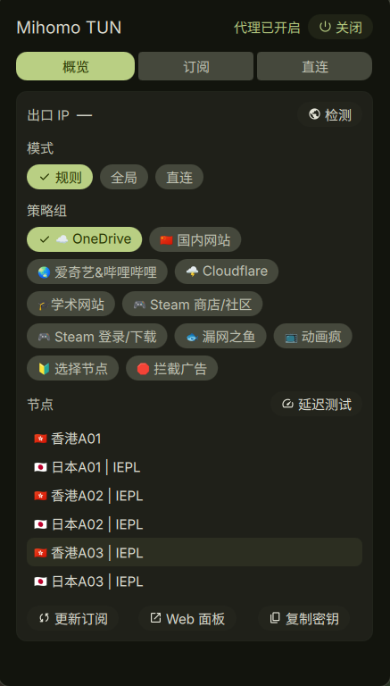

# Mihomo TUN (DMS)

A [DankMaterialShell](https://github.com/AvengeMedia/DankMaterialShell) plugin
that controls a local, systemd-managed **mihomo** TUN service: start / stop,
proxy mode, proxy groups and nodes, subscriptions, DIRECT rules, and the exit
IP. It also carries the full install and configuration flow.

A port of the earlier [mihomo-tun](https://github.com/matsuzaka-yuki/mihomo-tun)
plugin (MIT). The Python helper is reused unchanged; the UI is native to DMS.



## What it does

- Write a TUN-capable `/etc/mihomo/config.yaml`, the controller secret, and the
  plugin's DIRECT rule provider — `install.sh`.
- Start / stop `mihomo.service` from a bar pill (left click opens the panel).
- Switch rule / global / direct mode.
- Browse proxy groups and pick a node.
- Check the effective exit IP.
- Manage subscriptions and DIRECT rules (the helper edits the config through a
  single `pkexec` authorization).

## Requirements

- Linux with systemd, and a running mihomo external controller.
- `mihomo` installed and on `PATH`. `install.sh` no longer installs packages
  (running an AUR helper as root is rejected by makepkg, and package managers
  differ per distro); install mihomo yourself first — Arch: `paru -S mihomo-bin`,
  otherwise the [upstream releases](https://github.com/MetaCubeX/mihomo/releases)
  or your distro's package manager.
- `python3` and `systemctl` on `PATH`.
- Permission to `systemctl start/stop` the unit (a narrow polkit rule; the
  plugin never runs `sudo`).
- `pkexec`/polkit for subscription and DIRECT-rule edits, which change the
  root-owned config.

## Install

Through the NyxDeck CLI, which owns the whole chain (core → config →
dashboard → service → DMS plugin):

```sh
nyxdeck mihomo install          # full pipeline, idempotent
nyxdeck mihomo dashboard        # only the local dashboard at /ui/
nyxdeck mihomo status
```

Directly, from a checkout:

```sh
sudo ./install.sh               # config + DIRECT provider + dashboard + unit (mihomo must be installed)
sudo ./scripts/install-dashboard.sh   # dashboard only
```

The install writes `/etc/mihomo`, installs **metacubexd** into
`/etc/mihomo/ui`, adds `external-ui` to the config, and enables the unit.
Mihomo only serves `/ui/` when `external-ui` is set, so without that step the
panel's *Web panel* button has nothing to open (it falls back to the hosted
dashboard and copies the secret to your clipboard).

Plugin only (until it is in the registry):

```sh
git clone https://github.com/NyxDeck/mihomo-tun.git \
    ~/.config/DankMaterialShell/plugins/mihomoTun
dms restart
```

Then add the widget to the bar and open its panel. Settings hold the controller
URL, secret file, unit name, and polling interval.

### Dashboard options

`install-dashboard.sh` accepts `--force` (re-download), `--url URL` (mirror),
`--name` (UI name), `--no-restart`, and honours `MIHOMO_UI_URL`,
`MIHOMO_UI_DIR`, `MIHOMO_CONFIG_FILE`, `MIHOMO_UNIT`.

## Layout

```
plugin.json            DMS plugin manifest
MihomoService.qml      daemon: polls the controller (light `watch`; full `status` on demand), exposes `dms ipc call mihomoTun ...`
MihomoWidget.qml       bar pill + popout
MihomoPanel.qml        popout panel (overview / subscriptions / direct rules)
MihomoSettings.qml     settings page
install.sh             full mihomo install / configuration flow
scripts/install-dashboard.sh  install metacubexd + external-ui
scripts/mihomo-ctl.py  controller backend (one JSON object per call)
scripts/configure-direct-rules.py    root DIRECT rule-provider setup
scripts/apply-subscription-change.py subscription edits
scripts/admin_common.py              root helpers' trusted-path resolution
```

The backend is usable on its own:

```sh
python3 scripts/mihomo-ctl.py status
python3 scripts/mihomo-ctl.py toggle
python3 scripts/mihomo-ctl.py group PROXY
python3 scripts/mihomo-ctl.py select PROXY 'node name'
python3 scripts/mihomo-ctl.py mode global
python3 scripts/mihomo-ctl.py ip
```

## Security model

The controller secret lives at `/etc/mihomo/.controller-secret`. The installer
keeps it `0600` and grants read access to the user who ran it through an ACL
(`setfacl -m u:<user>:r`) rather than their primary group, because the plugin
reads it as that user — a `0600` root-owned file makes every controller call
fail, while a group-readable one would expose the secret to every member of a
possibly shared group. Where `setfacl` is unavailable it falls back to the
primary group and warns. If you installed as plain root, run
`sudo setfacl -m u:<user>:r /etc/mihomo/.controller-secret`.

- The controller secret is read from a local file and never stored in the
  plugin settings.
- Starting and stopping the service is a privileged operation; scope
  systemd/polkit narrowly instead of granting broad passwordless access.
- Subscription edits change the root-owned mihomo config. The installer places
  the helpers under `/usr/local/libexec/mihomo-tun` (root-owned) and a polkit
  action next to them, so `pkexec` runs a root-owned program — never a script
  from the user-writable plugin directory — with a prompt that names the action
  instead of a bare `python3`. The helpers validate the candidate config
  themselves and resolve `mihomo` to a root-owned, non-writable binary before
  using it.

## Languages

The panel and the settings page follow DMS' own language setting. English is the
source text written into the QML; other languages live in `translations/`, one
flat `{"Term": {"Term": "Translation"}}` map per locale, which DMS loads when it
discovers the plugin. A term with no entry falls back to the English text, so a
partial translation is fine.

`zh_CN.json` ships with the plugin. To add another language, copy it, translate
the values and name the file after the locale (`fr.json`, `pt_BR.json`, ...).

## Credits & license

Ported from [matsuzaka-yuki/mihomo-tun](https://github.com/matsuzaka-yuki/mihomo-tun)
(MIT). MIT licensed; see [LICENSE](LICENSE).
